# Veo Social App

> 🎬 An open-source AI-powered social media platform built with Google's Veo 3.1 video generation and Imagen 4.0 image generation

[](https://opensource.org/licenses/MIT)
[](https://flutter.dev)
[](https://python.org)
[](https://fastapi.tiangolo.com)

---

## ⚠️ Cost Warning

**This project uses Google Cloud Platform's paid APIs.** Running this application will incur costs:

- **Veo 3.1 Video Generation**: ~$0.10-0.30 per video
- **Imagen 4.0 Image Generation**: ~$0.02-0.05 per image
- **Firebase Storage**: Pay per GB stored/transferred
- **Cloud Firestore**: Pay per read/write operation

**Estimated costs**: $10-50+ per month depending on usage.

> 💡 **Free Development Mode**: The backend supports a mock mode (`ENABLE_MOCKS=true`) for testing without API calls.

---

## ✨ Features

### 🎭 Personalized AI Generation

**The Magic: Your AI Avatar**

Upload 3 profile views (front, left profile, right profile) and the app creates a personalized AI model of YOU. Then:

- ✨ **Generate videos with yourself in them** - "Me skateboarding through cyberpunk Tokyo"
- ✨ **Create images featuring you** - "Me as a superhero in space"
- ✨ **Your likeness is stored in your profile** - One-time setup, use everywhere
- ✨ **Privacy-first** - Your profile images are your data, always under your control

The app automatically passes your profile views to Veo/Imagen when you enable "Include Me" in the composer.

### 🎨 Content Creation

- 🎥 **AI Video Generation** using Google's Veo 3.1 (up to 8 seconds)
- 🖼️ **AI Image Generation** using Imagen 4.0
- � **Reference Images** - Upload up to 3 additional reference images per post (separate from profile)
  - Use for style references, objects, or scenes you want in the generation
  - Example: Upload a photo of your dog, then generate "my dog surfing in Hawaii"
- 📱 **Multiple Aspect Ratios** (1:1 square, 9:16 vertical, 16:9 horizontal)
- 🔒 **Private/Public Content** control

### 📱 Social Features

- 📊 **Smart Feed Algorithm**:
  - **Interest Feed (60%)**: Content based on your interactions and preferences
  - **Explore Feed (25%)**: Trending and diverse content discovery
  - **Trending Feed (15%)**: Popular content across the platform
- ⚡ **Real-time Updates** with Firebase
- 🎨 **Beautiful UI** with smooth animations and transitions
- 🔐 **Authentication** (mock local auth + Firebase Auth ready)
- 📈 **Usage Limits** to control costs (configurable free tier)

---

## � How It Works: The "Include Me" Feature

```
1. Setup Your Profile (One-Time)
   ┌─────────────────────────────────────────┐
   │  📸 Capture 3 Profile Views             │
   │                                          │
   │  1️⃣ Front-facing view                   │
   │  2️⃣ Left profile (45°)                  │
   │  3️⃣ Right profile (45°)                 │
   │                                          │
   │  ✅ Stored in your profile               │
   └─────────────────────────────────────────┘
                    │
                    ▼
2. Create Content
   ┌─────────────────────────────────────────┐
   │  ✏️ Write your prompt                    │
   │  "Me riding a dragon over a volcano"    │
   │                                          │
   │  ☑️ Check "Include Me"                  │
   │                                          │
   │  🎬 Generate →                           │
   └─────────────────────────────────────────┘
                    │
                    ▼
3. AI Magic Happens
   ┌─────────────────────────────────────────┐
   │  Backend automatically:                  │
   │  • Loads your 3 profile images           │
   │  • Sends to Veo 3.1 / Imagen 4.0        │
   │  • Includes subject_reference_images     │
   │                                          │
   │  🤖 AI generates YOU in the scene        │
   └─────────────────────────────────────────┘
                    │
                    ▼
4. Result
   ┌─────────────────────────────────────────┐
   │  🎉 Video/Image with YOU in it!          │
   │                                          │
   │  • Your likeness preserved               │
   │  • Natural integration into scene        │
   │  • Shareable on your feed                │
   └─────────────────────────────────────────┘
```

**Profile Images vs Reference Images:**

- **Profile Images** (3 views): Your AI avatar, stored in your profile, used when "Include Me" is enabled
- **Reference Images** (optional, up to 3 per post): Style/object/scene references for individual generations

---

## 🗺️ Architecture

```
┌────────────────────────────────────────────────────────┐
│                      Flutter App (Dart)                     │
│  ┌──────────────┬──────────────┬────────────────────┐    │
│  │   Composer   │   Feed View  │   Profile & Settings │    │
│  └──────────────┴──────────────┴────────────────────┘    │
└────────────────────────────────┬───────────────────────┘
                                 │ REST API
                         ▼
┌─────────────────────────────────────────────────────────────┐
│                FastAPI Backend (Python)                     │
│  ┌──────────────┬──────────────┬──────────────────────┐    │
│  │  Generation  │  Feed Logic  │  Storage Management  │    │
│  └──────────────┴──────────────┴──────────────────────┘    │
└────────────────────────┬────────────────────────────────────┘
                         │
         ┌───────────────┼───────────────┐
         ▼               ▼               ▼
┌──────────────┐ ┌──────────────┐ ┌──────────────┐
│  Vertex AI   │ │  Firestore   │ │   Firebase   │
│  (Veo/Imagen)│ │  (Database)  │ │   Storage    │
└──────────────┘ └──────────────┘ └──────────────┘
```

---

## 🚀 Quick Start

### Prerequisites

- **Flutter SDK** 3.x or higher
- **Python** 3.11 or higher
- **Google Cloud Platform** account (for production)
- **Firebase** project (free tier available)

### 1. Clone the Repository

```bash
git clone https://github.com/YOUR-USERNAME/veo-social-app.git
cd veo-social-app
```

### 2. Backend Setup (Development Mode)

```bash
cd backend

# Create virtual environment
python -m venv .venv

# Activate virtual environment
# Windows:
.venv\Scripts\activate
# macOS/Linux:
source .venv/bin/activate

# Install dependencies
pip install -r requirements.txt

# Copy environment template
copy .env.example .env

# Edit .env and ensure ENABLE_MOCKS=true for free testing

# Run the backend
uvicorn src.main:app --host 0.0.0.0 --port 8000 --reload
```

Backend will be available at `http://localhost:8000`

### 3. Flutter App Setup

```bash
cd app

# Copy environment template
copy .env.example .env

# Edit .env and set API_BASE_URL=http://localhost:8000

# Get Flutter dependencies
flutter pub get

# Run the app
flutter run
```

---

## 📖 Full Setup Guide

For production deployment with real AI generation, see:

- **[SETUP.md](docs/SETUP.md)** - Complete step-by-step setup
- **[ARCHITECTURE.md](docs/ARCHITECTURE.md)** - System design and components
- **[COSTS.md](docs/COSTS.md)** - Detailed pricing breakdown
- **[API_REFERENCE.md](docs/API_REFERENCE.md)** - API documentation

---

## 🧪 Development Mode (Free)

The backend supports **mock mode** for development without incurring costs:

```bash
# In backend/.env
ENABLE_MOCKS=true
```

Mock mode will:

- ✅ Generate placeholder videos/images instantly
- ✅ Simulate feed algorithms
- ✅ Test all features without API calls
- ✅ Perfect for UI development and testing

---

## 🛠️ Tech Stack

### Frontend

- **Flutter/Dart** - Cross-platform mobile framework
- **Riverpod** - State management
- **Firebase SDK** - Auth, Storage, Firestore

### Backend

- **Python 3.11+** - Programming language
- **FastAPI** - Modern async web framework
- **Vertex AI SDK** - Google's AI models
- **Firebase Admin SDK** - Backend services

### Infrastructure

- **Google Cloud Platform**:
  - Vertex AI (Veo 3.1, Imagen 4.0, Gemini)
  - Cloud Firestore (NoSQL database)
  - Firebase Storage (Media storage)
- **Optional**: Cloud Run for deployment

---

## 📸 Screenshots & Demo

### 🎬 Video Demos

<table>
  <tr>
    <td width="50%">
      <b>App Demo Video 1</b><br/>
      https://github.com/user-attachments/assets/a1b88694-9530-4172-9ff7-c7ef8983eae3
    </td>
    <td width="50%">
      <b>App Demo Video 2</b><br/>
      https://github.com/user-attachments/assets/4e9d4ee2-8e62-4fca-83de-316b074bebb7
    </td>
  </tr>
</table>

### 🖼️ App Screenshots

<table>
  <tr>
    <td width="25%">
      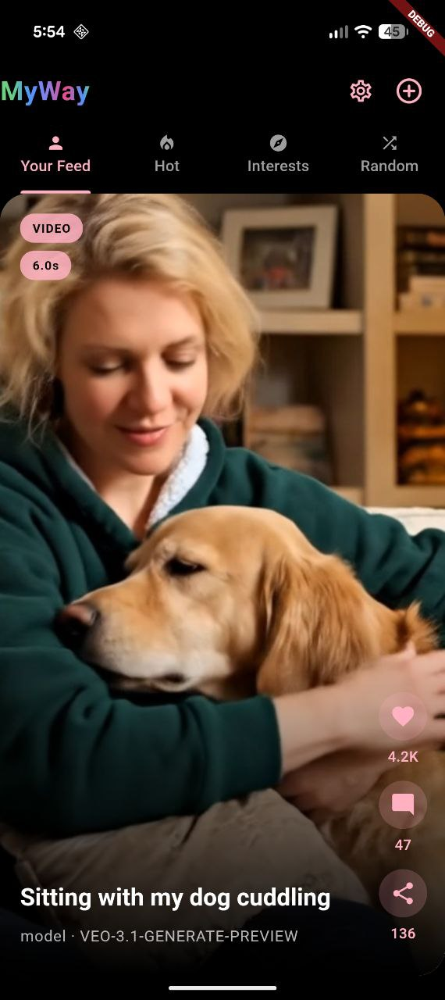
      <p align="center"><b>📱 Smart Feed</b><br/>AI-generated content in your personalized feed</p>
    </td>
    <td width="25%">
      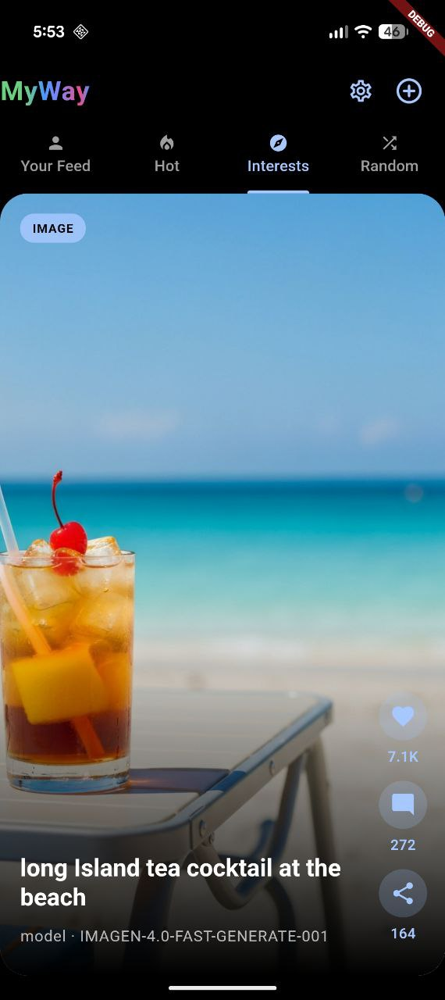
      <p align="center"><b>🎥 Post Detail</b><br/>View AI-generated videos and images</p>
    </td>
    <td width="25%">
      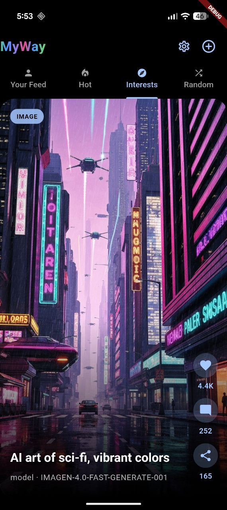
      <p align="center"><b>👤 Profile</b><br/>Your generated content and settings</p>
    </td>
    <td width="25%">
      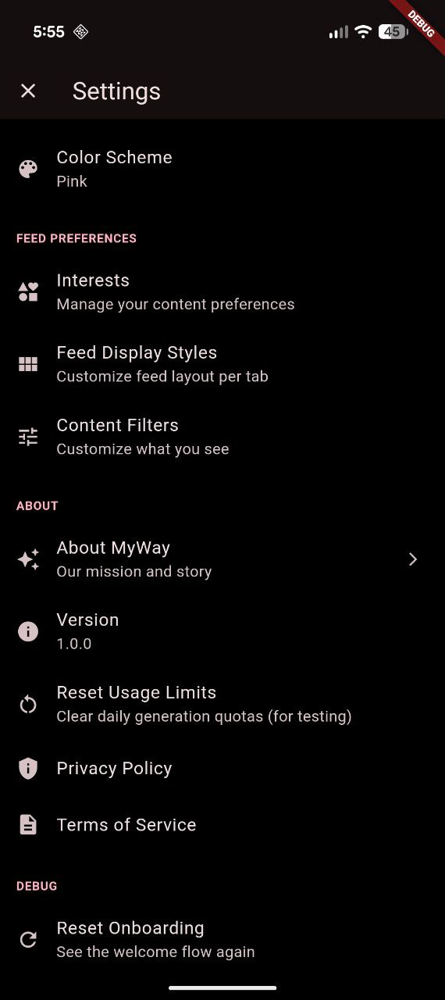
      <p align="center"><b>✏️ Content Composer</b><br/>Create with text prompts and reference images</p>
    </td>
  </tr>
  <tr>
    <td width="25%">
      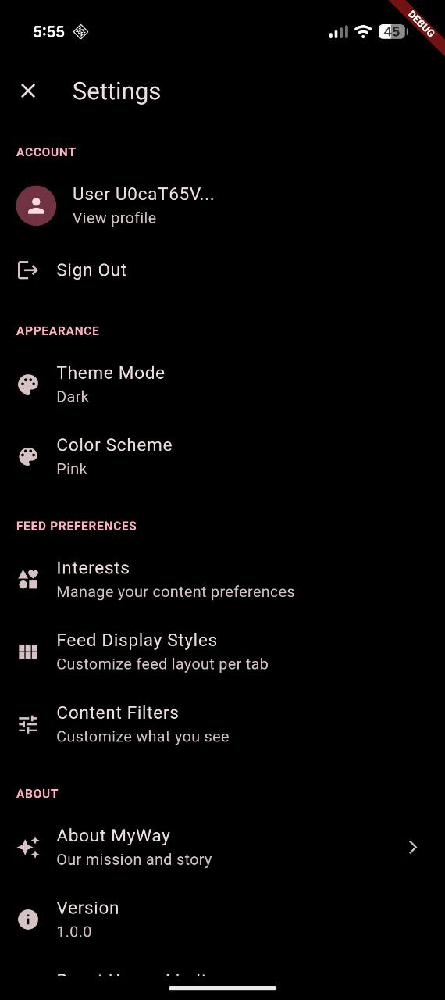
      <p align="center"><b>🎨 Generation Options</b><br/>Choose aspect ratio, include yourself, add references</p>
    </td>
    <td width="25%">
      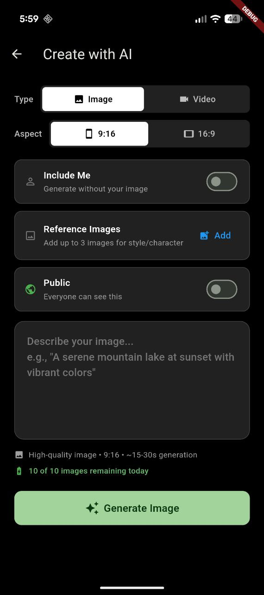
      <p align="center"><b>⚙️ Settings</b><br/>Configure app behavior and preferences</p>
    </td>
    <td width="25%">
      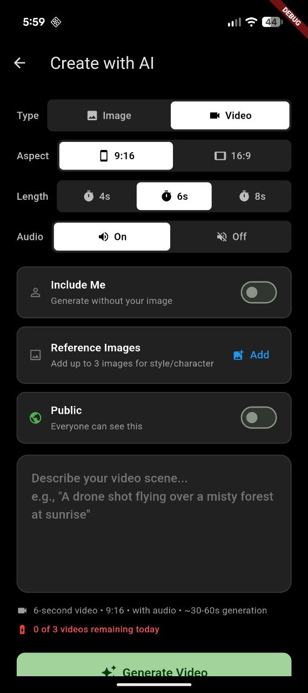
      <p align="center"><b>⚙️ Advanced Settings</b><br/>Customize generation parameters</p>
    </td>
    <td width="25%">
      
      <p align="center"><b>🎯 Onboarding</b><br/>Get started with the app</p>
    </td>
  </tr>
</table>

**More Screenshots**

<table>
  <tr>
    <td width="25%">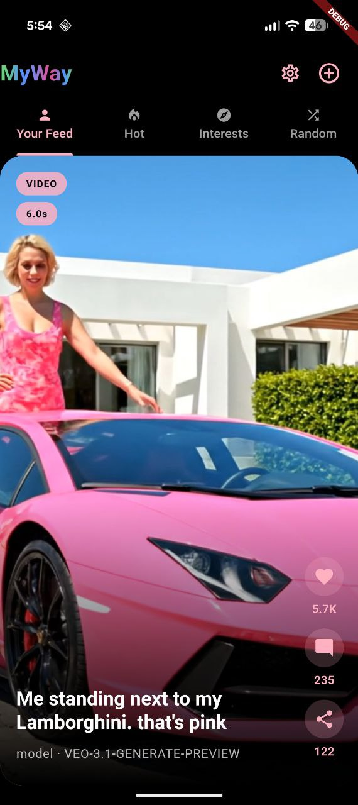<p align="center"><sub>Feed Alternative View</sub></p></td>
    <td width="25%">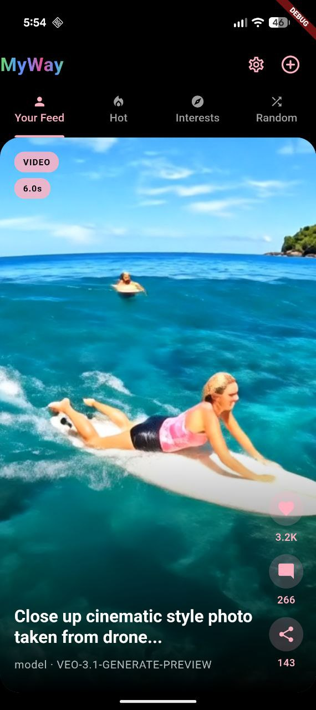<p align="center"><sub>Feed Explore Mode</sub></p></td>
    <td width="25%">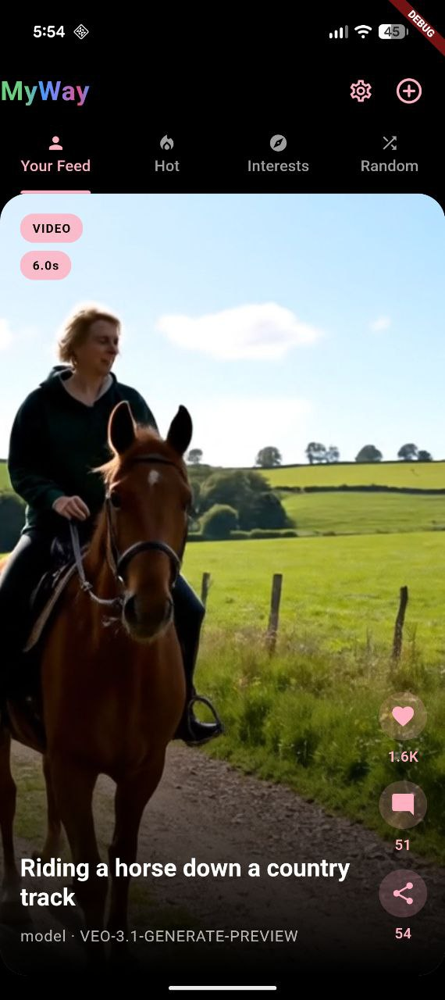<p align="center"><sub>Content Browse</sub></p></td>
    <td width="25%">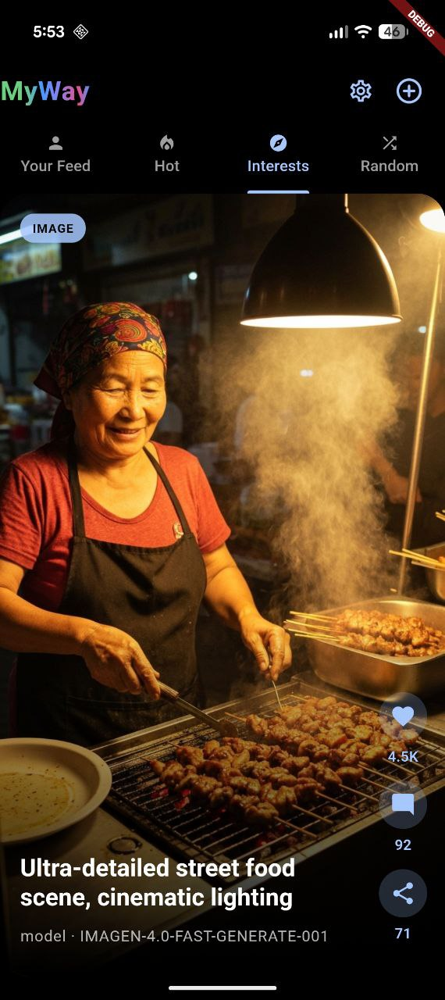<p align="center"><sub>Post Details</sub></p></td>
  </tr>
  <tr>
    <td width="25%">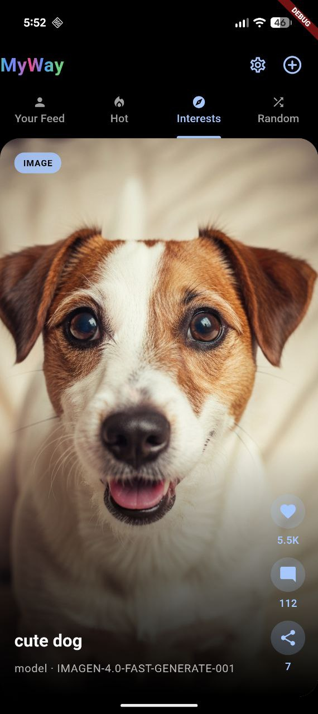<p align="center"><sub>Image View</sub></p></td>
    <td width="25%">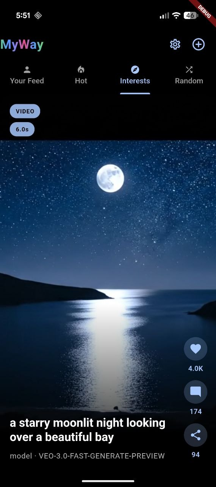<p align="center"><sub>Content Grid</sub></p></td>
    <td width="25%">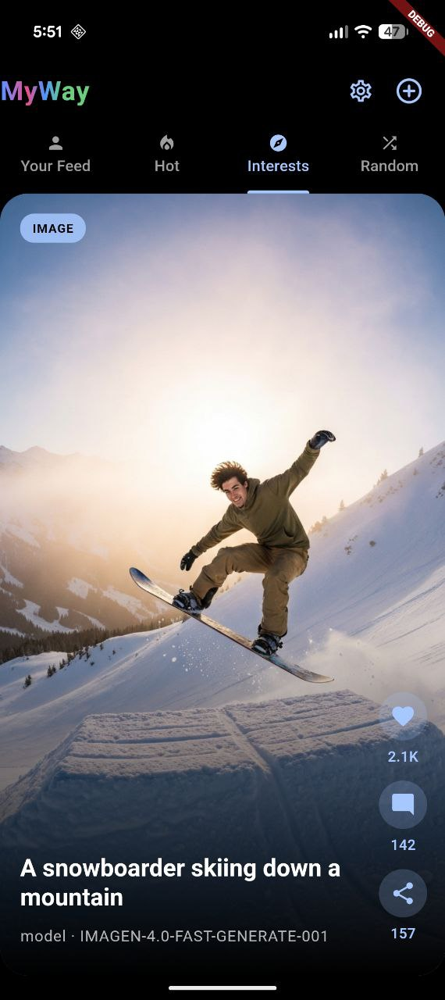<p align="center"><sub>Generation</sub></p></td>
    <td width="25%">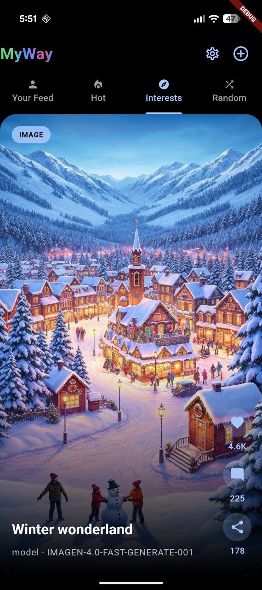<p align="center"><sub>Results</sub></p></td>
  </tr>
  <tr>
    <td width="25%"><p align="center"><sub>App Interface</sub></p></td>
    <td width="25%"><p align="center"><sub>User Interface</sub></p></td>
    <td width="25%"><p align="center"><sub>Content Creation</sub></p></td>
    <td width="25%"><p align="center"><sub>Video Generation</sub></p></td>
  </tr>
  <tr>
    <td width="25%"><p align="center"><sub>AI Features</sub></p></td>
    <td width="25%"><p align="center"><sub>Profile Setup</sub></p></td>
    <td width="25%"><p align="center"><sub>Content Feed</sub></p></td>
    <td width="25%"><p align="center"><sub>Generation Options</sub></p></td>
  </tr>
  <tr>
    <td width="25%">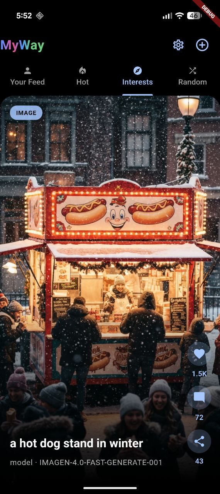<p align="center"><sub>Media Gallery</sub></p></td>
    <td width="25%">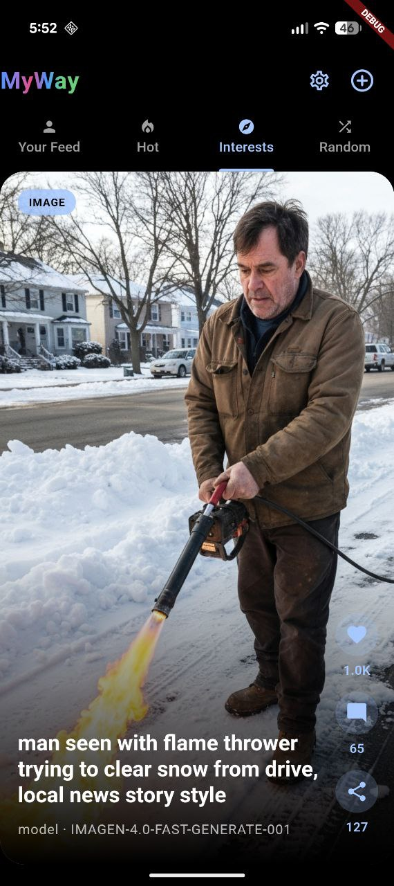<p align="center"><sub>Settings Menu</sub></p></td>
    <td width="25%">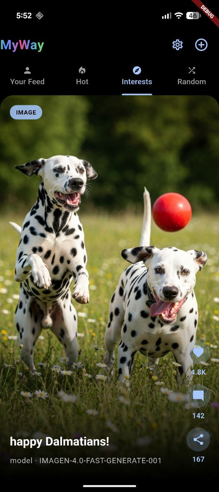<p align="center"><sub>User Experience</sub></p></td>
    <td width="25%">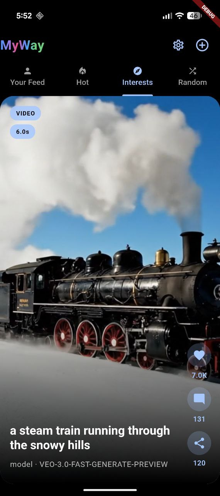<p align="center"><sub>App Navigation</sub></p></td>
  </tr>
  <tr>
    <td width="25%">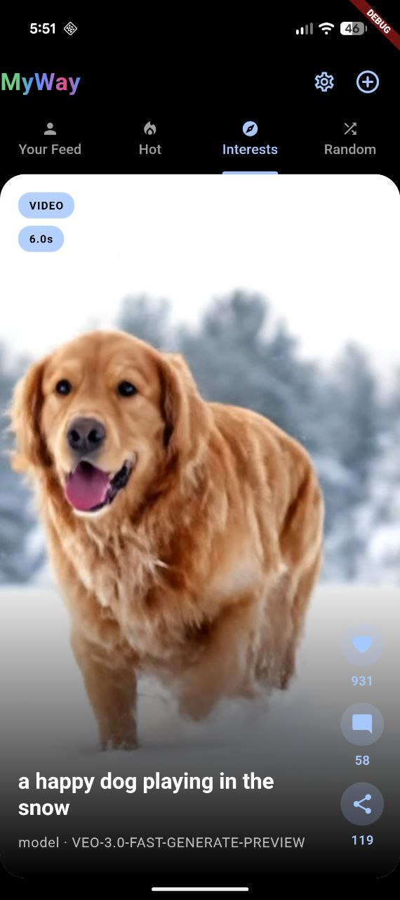<p align="center"><sub>Content Discovery</sub></p></td>
    <td width="25%"><p align="center"><sub>Social Features</sub></p></td>
    <td width="25%"><p align="center"><sub>Generation Process</sub></p></td>
    <td width="25%"><p align="center"><sub>Result Viewing</sub></p></td>
  </tr>
  <tr>
    <td width="25%"><p align="center"><sub>Advanced Features</sub></p></td>
    <td width="25%">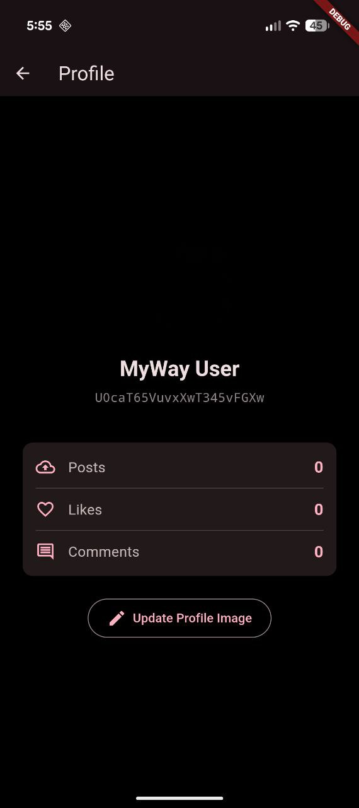<p align="center"><sub>Settings Screen</sub></p></td>
    <td width="25%">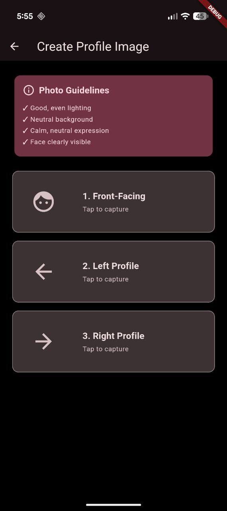<p align="center"><sub>Configuration</sub></p></td>
    <td width="25%"><p align="center"><sub>Preferences</sub></p></td>
  </tr>
  <tr>
    <td width="25%"><p align="center"><sub>Advanced Options</sub></p></td>
    <td width="25%"><p align="center"><sub>User Settings</sub></p></td>
    <td width="25%"><p align="center"><sub>App Configuration</sub></p></td>
    <td width="25%"></td>
  </tr>
</table>

### ✨ Key Features Shown

- 🎭 **Profile Image Capture**: 3-view setup for personalized generation
- 🎬 **AI Video Generation**: Veo 3.1 creating 8-second videos
- 🖼️ **AI Image Generation**: Imagen 4.0 with multiple aspect ratios
- 📸 **Reference Images**: Upload style/object references
- 📊 **Smart Feed**: Interest-based, Explore, and Trending content
- ⚡ **Real-time UI**: Smooth animations and transitions

---

## 🤝 Contributing

We welcome contributions! Please see [CONTRIBUTING.md](CONTRIBUTING.md) for guidelines.

### Development Workflow

1. Fork the repository
2. Create a feature branch (`git checkout -b feature/amazing-feature`)
3. Make your changes
4. Test thoroughly (mock mode + real API if possible)
5. Commit your changes (`git commit -m 'Add amazing feature'`)
6. Push to your branch (`git push origin feature/amazing-feature`)
7. Open a Pull Request

---

## 📄 License

This project is licensed under the MIT License - see the [LICENSE](LICENSE) file for details.

---

## 🙏 Acknowledgments

- **Google Cloud** for providing Vertex AI APIs (Veo 3.1, Imagen 4.0, Gemini)
- **Flutter Team** for the amazing framework
- **FastAPI** for the excellent Python framework
- **Firebase** for backend infrastructure

---

## 📞 Support & Community

- 🐛 **Issues**: [GitHub Issues](https://github.com/YOUR-USERNAME/veo-social-app/issues)
- 💬 **Discussions**: [GitHub Discussions](https://github.com/YOUR-USERNAME/veo-social-app/discussions)
- 📧 **Email**: [YOUR-EMAIL]

---

## ⚖️ Responsible AI Use

This project is designed for educational and experimental purposes. When deploying:

1. **Content Moderation**: Implement content filtering for user-generated prompts
2. **Rate Limiting**: Control API usage to manage costs
3. **Terms of Service**: Define acceptable use policies
4. **Privacy**: Handle user data responsibly
5. **Cost Management**: Set budget alerts in GCP

---

## 🗺️ Roadmap

- [ ] Add web support
- [ ] Implement content moderation
- [ ] Add video editing features
- [ ] Multi-language support
- [ ] Advanced feed personalization
- [ ] Social features (comments, likes, shares)
- [ ] Export/download capabilities

---

**Built with ❤️ for the AI community**

> ⚠️ **Reminder**: This is experimental software. Use responsibly and monitor your cloud costs!
